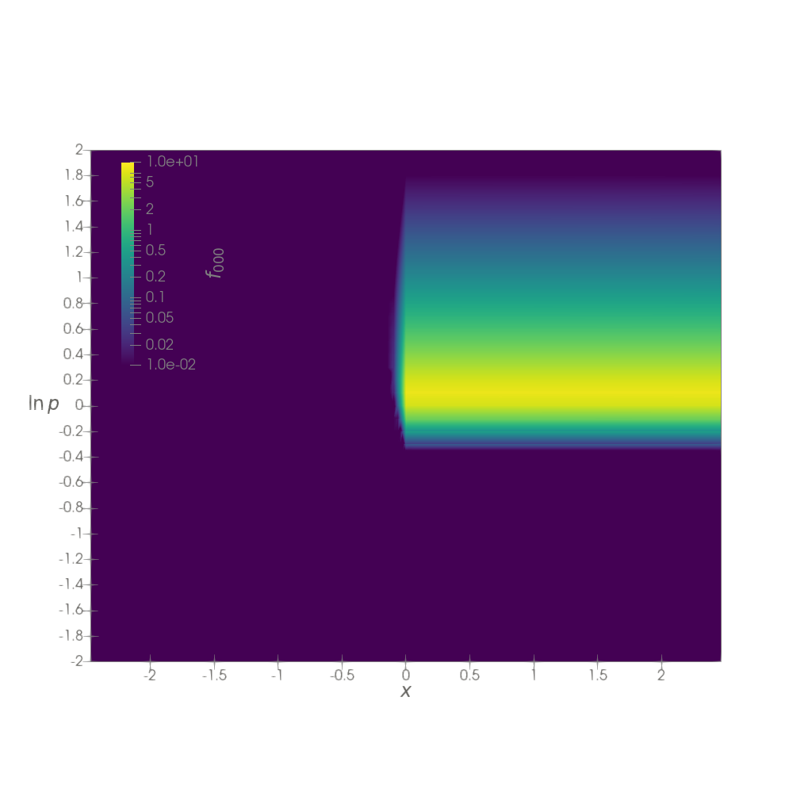

# Quick-start

To get started with `sapphireppplot`,
this tutorial reproduces the plots from the
[Quick-start example](https://sapphirepp.org/latest/quick-start.html)
of Sapphire++.
The script presented here can be found in the `examples` folder as
[plot_quick_start.py](https://github.com/sapphirepp/sapphireppplot/blob/main/examples/plot_quick_start.py).

## Preamble

First, import `numpy` and the `vfp` and `numpyify` modules from `sapphireppplot`.
Then, define the `main` function to create the plots:

```python
import numpy as np
from sapphireppplot import vfp, numpyify


def main() -> dict:
    """Plot quick-start example."""
```

## Loading Results

Before loading the Sapphire++ results,
we use the `PlotProperties` class to define general properties for the solution and plots.
This data class helps to configure properties that are reused between plots,
such as font size and text color,
in a single place.
Here, we use the `PlotPropertiesVFP` version,
which automatically sets labels for `f_lms` and axes
for results produced by the Sapphire++ — VFP module.

For the quick-start example,
the reduced phase space is of dimension `2`,
and momentum terms are activated in Sapphire++.
We also set the `color_bar_position` and enable a transparent background for animations:

```python
    plot_properties = vfp.PlotPropertiesVFP(
        dimension=2,
        momentum=True,
        color_bar_position=[0.15, 0.55],
        animation_transparent_background=True,
    )
```

To load the Sapphire++ results,
use the `load_solution` function from the `vfp` module, which simplifies the process.
This function retrieves the `results_folder`
(which can be given as a relative path with respect to `path_prefix`)
either from a command line argument or by prompting user input.
Furthermore, it loads the parameter log file as a dictionary (`prm`),
loads the solution data (`solution`),
and sets the animation time to the last time step.
The currently displayed time step can be changed using `animation_scene`.

It is recommended to set an environment variable `$SAPPHIREPP_RESULTS`
to specify the path to Sapphire++ results
and to use subfolders for different examples, such as `quick-start`.

```python
    results_folder, prm, solution, animation_scene = vfp.load_solution(
        plot_properties,
        path_prefix="$SAPPHIREPP_RESULTS/quick-start",
    )
```

## Plotting a 2D Render View

As a first plot, we show the 2D view of the data.
The figure is named `quick-start-2D`
and saved in the same `results_folder` as the Sapphire++ results.
To display the $f_{000}$ component, set `lms_index=[0, 0, 0]`.
Since the plot uses a logarithmic color scale, we define the `value_range` to display.
In addition to the image at the final time (`quick-start-2D.png`),
an animation is saved as a series of PNG files (`quick-start-2D.XXXX.png`).

```python
    layout_2d, render_view_2d = vfp.plot_f_lms_2d(
        solution,
        results_folder,
        "quick-start-2D",
        plot_properties,
        lms_index=[0, 0, 0],
        value_range=[1e-2, 10.0],
        save_animation=True,
    )
```



## Plotting $f(x)$

Next, we show the solution as a function of $x$ using the `PlotOverLine` tool in ParaView.
The `vfp.plot_f_lms_over_x` function creates the `PlotOverLine`
and displays it in a `LineChartView`,
handling the ParaView internals.
We specify the file name (`quick-start-f-x`),
the $f_{000}$ and $f_{100}$ lines to plot (`lms_indices=[[0, 0, 0], [1, 0, 0]]`),
set the direction to $x$,
and use an offset to specify that the profile is shown at $\ln p = 0.05$
(avoiding sampling at cell edges).

```python
    plot_over_line_x, layout_x, line_chart_view_x = vfp.plot_f_lms_over_x(
        solution,
        results_folder,
        "quick-start-f-x",
        plot_properties,
        lms_indices=[[0, 0, 0], [1, 0, 0]],
        direction="x",
        offset=[0, 0.05, 0],
        x_label=r"$x$",
    )
```


## Plotting $p^4 f(p)$

As a final plot, we show the scaled spectrum $p^4 f_{000}$ at $x=0.1$.
First, scale the distribution function to $p^4 f$ using `vfp.scale_distribution_function`.
Then, plot the spectrum of the scaled solution (`solution_scaled`) using `vfp.plot_f_lms_over_p`,
showing only the $f_{000}$ component.

```python
    solution_scaled, plot_properties_scaled = vfp.scale_distribution_function(
        solution, plot_properties
    )

    plot_over_line_p, layout_p, line_chart_view_p = vfp.plot_f_lms_over_p(
        solution_scaled,
        results_folder,
        "quick-start-f-p",
        plot_properties_scaled,
        lms_indices=[[0, 0, 0]],
        offset=[0.1, 0, 0],
        value_range=[1e-2, 16.0],
    )
```


## Using NumPy: Calculate the Spectral Index

To extract NumPy arrays from the ParaView data, use the `numpyify` module.
As an example, we use the spectrum retrieved from `plot_over_line_p`
and calculate the spectral index $s$.
To return the `ln_p` coordinates, specify `x_direction=1`,
and select only `f_000` as the array to be returned.
We mask out values to use only $p > 2 p_{\rm inj}$,
then calculate the spectral index using the log-log slope:

```python
    ln_p, data = numpyify.to_numpy_1d(
        plot_over_line_p,
        array_names=["f_000"],
        x_direction=1,
        # Only use data above 2*injection momentum (p_inj = 1)
        x_min=np.log(2.0),
    )
    ln_f = np.log(data[0])

    # Calculate log-log-slope of spectrum to find the spectral index
    spectral_index = (ln_f[-1] - ln_f[0]) / (ln_p[-1] - ln_p[0])

    print(f"Spectral Index: s = {spectral_index}")
```

## Postamble

To close the `main` function, return all local variables.
This allows all variables to be available in the Python console when running the script in ParaView,
so you can generate new plots or modify existing ones interactively.

```python
    return locals()


if __name__ in ["__main__", "__vtkconsole__"]:
    results = main()
    # Make all results available as global variables in a vtkconsole
    globals().update(results)
```

## Running Sapphire++

Before running the plotting script,
the Sapphire++ quick-start example must be run.
It is recommended to save the results in a `SAPPHIREPP_RESULTS` folder
(e.g., `sapphirepp/results` or elsewhere).
Defining an environment variable pointing to this folder
helps keep scripts portable between different machines.

```bash
export SAPPHIREPP_RESULTS=path/to/sapphirepp-results
```

In `SAPPHIREPP_RESULTS`, create a subfolder for the quick-start example
to collect all runs for this example:

```bash
cd $SAPPHIREPP_RESULTS
mkdir quick-start
```

Configure Sapphire++ to save the results in this folder
by setting the `Results folder` to the `quick-start` folder
and the `Simulation identifier` to a unique simulation subfolder, e.g., `01`.
Setting the appropriate parameters in the parameter file
and running Sapphire++ is done via:

```bash
cd path/to/sapphirepp

cat <<EOT >>quick-start.prm

subsection Output
  set Results folder = $SAPPHIREPP_RESULTS/quick-start
  set Simulation identifier = 01
end
EOT

./build/sapphirepp quick-start.prm
```

The results will be written to `$SAPPHIREPP_RESULTS/quick-start/01`:

```bash
ls $SAPPHIREPP_RESULTS/quick-start/01
> log.log
> log.prm
> solution_0000.0.vtu
> solution_0000.pvtu
> solution_0001.0.vtu
> solution_0001.pvtu
> ...
> solution_0200.0.vtu
> solution_0200.pvtu
```

## Using the Plotting Script

The `plot_quick_start.py` example script can be used to plot the results in three different ways:

### 1. Using Python

Activate the correct Conda environment with ParaView and `sapphireppplot` installed.
Then execute the script using Python,
providing the simulation folder `01`
(corresponding to the `Simulation identifier`)
as a command line argument:

```bash
conda activate sapplot
python sapphireppplot/examples/plot_quick_start.py 01
```

The plots are saved in the results folder `$SAPPHIREPP_RESULTS/quick-start/01` as PNG files.
Furthermore, the line outs for the `PlotOverLine` are saved as CSV files:

```bash
ls $SAPPHIREPP_RESULTS/quick-start/01
> log.log
> log.prm
> quick-start-2D.0000.png
> quick-start-2D.0001.png
> ...
> quick-start-2D.0200.png
> quick-start-2D.png
> quick-start-f-p.csv
> quick-start-f-p.png
> quick-start-f-x.csv
> quick-start-f-x.png
> solution_0000.0.vtu
> solution_0000.pvtu
> ...
```

The animation snapshots `quick-start-2D.XXXX.png` can be converted into an animated .gif
using [ImageMagick Convert](https://imagemagick.org/script/convert.php):

```bash
magick -delay 1 -loop 0 $SAPPHIREPP_RESULTS/quick-start/01/quick-start-2D.*.png $SAPPHIREPP_RESULTS/quick-start/01/quick-start-2D.gif
rm $SAPPHIREPP_RESULTS/quick-start/01/quick-start-2D.*.png
```

### 2. Using the ParaView Python Console

Open the ParaView installation linked to the `sapphireppplot` library:

```bash
conda activate sapplot
paraview&
```

Open the Python Shell in ParaView via `View > Python Shell`,
click on `Run Script`,
and select `sapphireppplot/examples/plot_quick_start.py`.
When prompted, enter `01` as the results folder
(evaluated relative to the `path_prefix` set in the script).

The preview windows for the plots will open automatically,
and the plots will be saved as PNG in the results folder.
All variables, such as `plot_over_line_p` or `spectral_index`,
are available in the Python console for further manipulation.

### 3. Using ParaView with a Remote Data Server

Remote visualization allows you to interactively work with data on a client machine
while the data remains on a remote machine (e.g., a cluster).
This avoids copying large data files
and instead communicates only the necessary information for visualization.

Open the ParaView GUI on the client side, using a ParaView installation linked to `sapphireppplot`:

```bash
conda activate sapplot
paraview&
```

Connect to a remote `pvserver` using `File > Connect...`.
The remote `pvserver` does not need to have `sapphireppplot` installed.

Once connected, follow the steps above to execute the script in the Python console:
`View > Python Shell` → `Run Script`.
When prompted, enter the *absolute path* to the results folder on the remote machine
(the configured `path_prefix` is for the client machine, so relative paths do not work):
`path/to/sapphirepp-results/on/remote/quick-start/01`.

The preview windows will open in ParaView,
and the figures will be saved in the results folder on the *remote machine*.

Further information on remote visualization is available at the
[ParaView documentation](https://docs.paraview.org/en/latest/ReferenceManual/parallelDataVisualization.html).